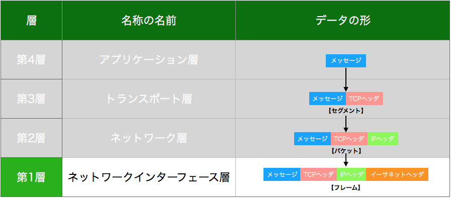

# ネットワークについて

# http
- [golang TCPサーバ/クライアントをつくって学ぶTCP/IPの基礎 | Black Everyday Company](https://kuroeveryday.blogspot.com/2018/08/how-to-build-tcp-server-with-goilang.html)
- おすすめ [TCPについて学ぶ - HTTP通信の流れを見てみる](https://www.mas9612.net/posts/dive-into-tcp-http/)

# https について
暗号化ってどこまでするの？
- [ＳＳＬでＨＴＴＰメッセージはどの部分が暗号化されるの？ - QA@IT](https://qa.atmarkit.co.jp/q/323)

# TCP/IP プロトコル
- [インターネット通信の流れ - Qiita](https://qiita.com/naoki_mochizuki/items/7ee0e01db61e1e7abd62)
- [令和の今だからこそ地球🌏の裏側までパケットを届けるIPを理解する - Qiita](https://qiita.com/zawawahoge/items/f810238daf02ca9042ce#_reference-b2334a9477a97ceb5f64)
- [TCP/IP - TCPとは - TCPヘッダ](https://www.infraexpert.com/study/tcpip8.html)

各層でデータの塊的なやつの名前が決まっているっぽい



```
アプリケーション(http, smtp, ftpとか) メッセージ
トランスポート(tcp, udp とか) メッセージ + tcp ヘッダ = セグメント
ネットワーク(ipとか) メッセージ + tcp ヘッダ + ip ヘッダ = パケット
ネットワーク・インターフェース(イーサネットとか) メッセージ + tcp ヘッダ + ip ヘッダ + イーサネットヘッダ = フレーム
```

# ネットワーク通信について調べるコマンド
- keywords: netstat, lsof, ifconfig, network interface, tcpdump, tshark

## netstat
> 名称の由来とされる「Network statistics」の意味の通り、ネットワーク接続やルーティングの状況、ネットワークインターフェース（NIC）の状態を報告するコマンドです。Linuxの場合、現在は非推奨扱いとされている「net-tools」に収録されているため、利用するディストリビューションによっては同パッケージの追加インストールが必要になります。

- [netstatコマンドとは？：ネットワーク管理の基本Tips - ＠IT](https://www.atmarkit.co.jp/ait/articles/1412/10/news003.html)

> netstatコマンドは、TCPおよびUDPプロトコルを対象に統計情報を表示します。TCPソケットを表示する「-t」、UDPソケットを表示する「-u」オプションと、多数用意されているオプションを組み合わせることが基本的な書式となります。

- -n: ホストやユーザーの名前解決を行わず数字のまま出力する

ちなみに port 8080 は名前解決すると http-alt となる

usage

``` shell
# listen してる tcp ソケットを調べる
netstat -l -t
# listen してる全てのアクティブなソケットを表示する
netstat -an | grep LISTEN
```

mac の netstat だと netstat -p ができないので lsof でプロセスを調べる必要がある

## lsof
PortやPID、プロセス名からファイルがオープンしている情報を表示するコマンド。

- [開いているファイルのプロセスを特定（lsofコマンド） - Qiita](https://qiita.com/yusabana/items/fd03ee4c90a0d1e0a8c6)

よく、 `netstat -an | grep LISTEN` して、 LISTEN してる PORT を調べて、その PORT が使用しているプロセスを調べるときに使う

usage

``` shell
# port 8080 で使用しているプロセスを調べる
lsof -i:8080 -P
```

## ifconfig
ifconfigコマンドはLinuxなど、主にUNIX系OSで用いるネットワーク環境の状態確認や設定確認、設定のためのコマンドだ。ホストに設置された有線LANや無線LANなどのネットワークインタフェースに対し、IPアドレスやサブネットマスク、ブロードキャストアドレスなどの基本的な設定ができる。加えて、現在の設定を確認できる。
Linuxでは、ifconfigコマンドが非推奨になった。ipコマンドへ移行することが推奨されている。

- [ifconfig ～（IP）ネットワーク環境の確認／設定を行う：ネットワークコマンドの使い方 - ＠IT](https://www.atmarkit.co.jp/ait/articles/0109/29/news004.html)
- [ターミナルからプライベートIPアドレスとMACアドレス、ルーティングテーブルを確認する - bambinya's blog](http://bambinya.hateblo.jp/entry/2015/04/04/234428)
- [ifconfigの出力結果に書いてあること - Qiita](https://qiita.com/TD3P/items/aff8db72530c6baa11b2)

usage

``` shell
# 存在するネットワークインタフェースごとのネットワーク設定を表示する
ifconfig -a
```

### ネットワーク・インターフェース
ネットワークに必要なインターフェース
AWS上でENI(Elastic Network Insterface)に値するもの。

物理的なハードウェアでは、NIC(ネットワークインターフェースカード)というカード型の拡張装置を用いる。
LAN ケーブルを差し込むハードウェア。アレが物理版の NIC。 LAN カードとかネットワークカードと呼ばれたりもする。

ホストに対してネットワークインターフェースをアタッチすることで、IPアドレスを割り当てることが可能になる。

NIC は IP アドレスを設定できるし、MAC アドレスも持っている。

> IPアドレスはNICに設定される
> IPアドレスは「ホスト」に対してではなく、NIC（ネットワークインターフェースカード）ごとに割り当てられる。
> 通常は1NIC-1IPアドレスになるが、1つのNICに複数のIPアドレスを割り当てることが可能だったり、複数のNICを備える機器（ルータなど）が存在する。
https://qiita.com/mogulla3/items/efb4c9328d82d24d98e6#1-3-ip%E3%82%A2%E3%83%89%E3%83%AC%E3%82%B9%E3%81%AFnic%E3%81%AB%E8%A8%AD%E5%AE%9A%E3%81%95%E3%82%8C%E3%82%8B

#### ネットワーク・インターフェースでよくあるやつ
- `en*` : Ethernet
- `ens*` ：有線の接続ポート。大体、最初は勝手にensの後に数字が振られる。
- `eth*` ：有線の接続ポート。上と内容は同じだが命名規則が変わった。こちらが旧。
- `lo*` ：ループバックのこと。実際はインターフェースとして存在しないが、テスト用などに仮想として必ずある。
- `virbr0` ：VMware使ってるから出てるらしい。
- `virbr0-nic` ：VMware使ってるから出てるらしい。nicはNetwork Interface Card

cf. [ネットワークインターフェイスの名前 - noyのブログ](http://noy.hatenablog.jp/entry/2017/02/27/163604)

## tcpdump
- ネットワーク通信の生データを収集し結果を出力(=パケットキャプチャ)してくれるCUIの解析ツール
- いつ、どこからどこへ、どんなフラグ(SYN,ACK,FIN等)のパケットが送られたか等が分かる。
- wireshark と同じことが(ほぼ)できる

cf.
- [超絶初心者むけtcpdumpの使い方 - Qiita](https://qiita.com/tossh/items/4cd33693965ef231bd2a)
- [tcpdump の便利なオプション - Qiita](https://qiita.com/ngyuki/items/969d1efaddb68acb5313)
- [tcpdumpの使い方 - Qiita](https://qiita.com/aosho235/items/d87e0d69e89513d02a3f)

usage

- -nn: ホスト名やポート番号をそのまま表示する
- -i: `tcpdump -i lo0 port 80` インタフェースを指定する。２枚刺しやブリッジとかしている場合は必須
- -X: `tcpdump -X port 80` パケットの内容を 16進とASCIIで表示する。あまり使わない。ipヘッダまでを含めたパケット？を見ることができる
- -XX: `tcpdump -XX port 80` イーサネットヘッダまでを含めたフレーム？を見ることができる
- -A: `tcpdump -A port 80` パケットの内容を ASCII で表示する。HTTP とか SMTP とかのキャプチャに便利
- -w file: `tcpdump -w {ファイル名} port 80` キャプチャ結果をファイルに出力する。出力されたファイルは Wireshark で開ける


``` shell
# 特定IPアドレスの80番ポートに関するトラフィックを見る (localhost (loopbackインターフェース)以外)
tcpdump port 80 and host 192.168.0.100
#
tcpdump lo0 port 8080 -nn
```

フォーマット

``` shell
src > dst: flags data-seqno ack window urgent options
```

```
通信時間           送信元IP              > 送信先IP                  フラグ     シーケンス番号  ウィンドウサイズ
16:58:46.899176 IP XXX.XXX.XXX.XXX.61372 > XXX.XXX.XXX.XXX.http-alt: Flags [S], seq 2816271339, win 65535, options [mss 1460,nop,wscale 4,nop,nop,TS val 33609312 ecr 0,sackOK,eol], length 0
```

フラグの意味

- S (SYN)
- F (FIN)
- P (PUSH)
- R (RST)
- U (URG)
- W (ECN CWR)
- E (ECN-Echo)
- . (ACK)
- none (何もフラグがない場合)

> Tcpflags are some combination of S (SYN), F (FIN), P (PUSH), R (RST), U (URG), W (ECN CWR), E (ECN-Echo)  or `.'  (ACK), or `none' if no flags are set.

## tshark(wireshark)
TCP/IPで流れるデータを確認できるパケットキャプチャツール
tshark は wireshark の CUI版 mac だと brew install wireshark && brew link wireshark で tshark のみ入る

- [Wiresharkでパケットキャプチャしてみた - yagisukeのWebなブログ](http://yagisuke.hatenadiary.com/entry/2017/03/11/213513)
- [tsharkのインストールとフィルタ・自動停止オプションの使い方まとめ | OXY NOTES](https://oxynotes.com/?p=7969)
- [Wiresharkを使った通信監視（後編）――コマンドラインベースでのパケットキャプチャ | さくらのナレッジ](https://knowledge.sakura.ad.jp/6311/)

usage

リアルタイムにパケットを表示する方法

フォーマット
`tshark -i <インタフェース> -Y <絞り込みの条件> -n`

- -i: (ネットワーク)インタフェースを指定する
- -Y: 絞り込み条件を所定のフォーマットで指定する ex. `tcp.port==8080`
- -f: 絞り込みをする。こちらは、フォーマットで指定をせず grep のように使う
- -n: 名前解決をせずに数字のまま出力する

``` shell
# ネットワークインターフェース lo0(ループバックインターフェース) の port 8080 でフィルターしてキャプチャをする
tshark -i lo0 -f "port 8080"

tshark -i lo0 -Y "tcp.port==8080"
```
